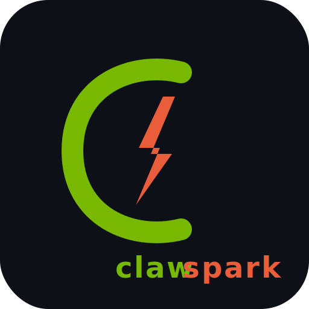

<p align="center">
  
</p>

<h1 align="center">CLAWSPARK</h1>

<p align="center">
  <a href="LICENSE"></a>
  <a href="COMMERCIAL-LICENSE.md"></a>
</p>

<p align="center">
  <strong>One command. Private AI agent. Your hardware.</strong>
</p>

<p align="center">
  <strong>Usage:</strong> Non-commercial use only for individuals, companies, and organizations.
  Commercialization, commercial consulting, and revenue-generating use require prior written permission.
</p>

<p align="center">
  <strong>Important:</strong> Availability on GitHub or npm does <em>not</em> grant commercial rights.
  See <a href="LICENSE">LICENSE</a>, <a href="NOTICE">NOTICE</a>, and <a href="COMMERCIAL-LICENSE.md">COMMERCIAL-LICENSE.md</a>.
</p>

<p align="center">
  <a href="https://clawspark.hitechclaw.com">Website</a> &middot;
  <a href="docs/tutorial.md">Tutorial</a> &middot;
  <a href="docs/configuration.md">Configuration</a> &middot;
  <a href="SECURITY.md">Security</a> &middot;
  <a href="NOTICE">License Notice</a> &middot;
  <a href="COMMERCIAL-LICENSE.md">Commercial Licensing</a> &middot;
  <a href="CONTRIBUTING.md">Contributing Guide</a> &middot;
  <a href="CHANGELOG.md">Changelog</a> &middot;
  <a href="#contributing">Contributing</a>
</p>

---

```bash
curl -fsSL https://clawspark.hitechclaw.com/install.sh | bash
```

That's it. Come back in 5 minutes to a fully working, fully private AI agent that can code, research, browse the web, analyze images, and manage your tasks. Everything runs on your hardware. No cloud APIs, no subscriptions, no telemetry.

During installation you can now optionally enter a public domain to enable **Caddy** with automatic HTTPS.
If you leave the domain blank, Caddy is not installed.

> **Licensing notice**
> Publishing or downloading this package from npm does not grant any commercial right.
> Use is limited to strictly non-commercial purposes unless separately authorized in writing by the copyright holder.

## v2 Preview

A new installer track is available in `v2/` for broader deployment targets:

- **CPU-first** installs for machines without GPUs
- **API-first** installs using third-party providers
- **Hybrid** installs that combine local and remote inference

Run it with:

```bash
bash v2/install.sh
```

Supported provider modes in `v2`:

- `ollama`
- `openai`
- `anthropic`
- `openrouter`
- `google`
- `custom`

`v2` now also reuses the stable installer modules for:

- default skills from `v2/configs/skills.yaml`
- local Whisper voice setup
- WhatsApp or Telegram onboarding
- security hardening and token generation

Useful v2 examples:

```bash
bash v2/install.sh --runtime=local-cpu --provider=ollama --messaging=skip
bash v2/install.sh --runtime=api-only --provider=openai --api-key=<your-key>
bash v2/install.sh --runtime=hybrid --provider=openrouter --messaging=telegram
bash v2/install.sh --runtime=api-only --provider=custom --provider-name="My Gateway" --base-url=https://llm.example.com/v1 --api-key=<your-key> --model=my-model
```

This does **not** replace the main installer yet. It is a separate v2 track for CPU and external API support.

When only `v2` is installed, the `clawspark` CLI now reads state from `~/.clawspark-v2` automatically.
If both tracks exist, select explicitly with:

```bash
CLAWSPARK_PROFILE=v2 clawspark status
CLAWSPARK_PROFILE=standard clawspark status
```

For remote and custom providers, `clawspark model list` now shows the active provider context and configured API endpoint instead of only local Ollama inventory.
`clawspark status` also performs a lightweight remote endpoint probe for API-backed profiles.
You can also update remote provider settings after install with commands such as `clawspark provider set openai --base-url=https://api.openai.com/v1 --api-key=<your-key>` or `clawspark provider set custom --name="My Gateway" --base-url=https://llm.example.com/v1 --api-key=<your-key>`.
Use `clawspark provider list` to see the built-in provider catalog and default endpoints.
Use `clawspark provider use <provider>` to switch quickly using the built-in default endpoint for that provider.
Running `clawspark provider use` with no provider now opens a provider selection flow.
Use `clawspark provider doctor` to validate the active provider configuration, expected env vars, endpoint reachability, and model/provider alignment.
Use `clawspark provider doctor --json` for automation-friendly diagnostics output.

## What is this?

[OpenClaw](https://github.com/openclaw/openclaw) is the most popular open-source AI agent (340K+ stars). **clawspark** gets it running on your NVIDIA hardware in one command. Fully local. Fully private. Your data never leaves your machine.

`clawspark` is built around **OpenClaw**. It is **not** "nemoclaw". `Nemotron` appears in this repository only as a **model option** on some hardware profiles, not as the agent framework name.

**What happens when you run it:**

1. Detects your hardware (DGX Spark, Jetson, RTX GPUs, Mac)
2. Picks the best model using [llmfit](https://github.com/AlexsJones/llmfit) for hardware-aware selection
3. Installs everything (Ollama, OpenClaw, 10 skills, dependencies)
4. Configures multi-model (chat + vision + optional image generation)
5. Enables voice (local Whisper transcription, zero cloud)
6. Sets up browser automation (headless Chromium)
7. Sets up your dashboard (chat UI + metrics)
8. Creates systemd services (auto-starts on boot)
9. Hardens security (firewall, auth tokens, localhost binding, Docker sandbox)

## Supported Hardware

| Hardware | Memory | Default Model | Tokens/sec |
|---|---|---|---|
| **DGX Spark** | 128 GB unified | Qwen 3.5 35B-A3B | ~59 (measured) |
| Jetson AGX Thor | 128 GB unified | Auto-selected | Community testing |
| Jetson AGX Orin | 64 GB unified | Auto-selected | Community testing |
| RTX 5090 / 4090 | 24-32 GB VRAM | Auto-selected | Community testing |
| RTX 4080 / 4070 | 8-16 GB VRAM | Auto-selected | Community testing |
| Mac M1/M2/M3/M4 | 16-128 GB unified | Auto-selected | Community testing |

NVIDIA platforms use [llmfit](https://github.com/AlexsJones/llmfit) to detect your hardware and pick the best model. macOS uses a curated fallback list.

## Quick Start

The installer asks 3 questions:

```
[1/3] Which model?         > 5 models ranked by hardware fit
[2/3] Messaging platform?  > WhatsApp / Telegram / Both / Skip
[3/3] Tailscale?           > Yes (remote access) / No
```

Zero interaction mode:

```bash
curl -fsSL https://clawspark.hitechclaw.com/install.sh | bash -s -- --defaults
```

Optional public HTTPS with Caddy:

```bash
curl -fsSL https://clawspark.hitechclaw.com/install.sh | bash -s -- --domain=agent.example.com
curl -fsSL https://clawspark.hitechclaw.com/install.sh | bash -s -- --domain=agent.example.com --dashboard-domain=metrics.example.com
```

- `--domain` publishes the Chat UI and gateway through Caddy with automatic HTTPS
- `--dashboard-domain` optionally exposes ClawMetry on a separate domain
- if no domain is provided, Caddy is skipped entirely
- DNS for the chosen domain must already point at the machine, and ports `80` and `443` must be reachable

## What Your Agent Can Do

| Capability | How it Works |
|---|---|
| **Answer questions** | Local LLM via Ollama |
| **Search the web** | Built-in web search + DuckDuckGo, no API key |
| **Deep research** | Sub-agents run parallel research threads |
| **Browse websites** | Headless Chromium (navigate, click, fill forms, screenshot) |
| **Analyze images** | Vision model for screenshots, photos, diagrams |
| **Write and run code** | exec + read/write/edit tools |
| **Voice notes** | Local Whisper transcription for WhatsApp voice messages |
| **File management** | Read, write, edit, search files on the host |
| **Scheduled tasks** | Cron-based automation |
| **Sub-agent orchestration** | Spawn parallel background agents |

All of this runs locally. No data leaves your machine.

## Skills

10 verified skills ship by default. Install curated bundles:

```bash
clawspark skills pack research      # Deep research + web search (4 skills)
clawspark skills pack coding        # Code generation + review (2 skills)
clawspark skills pack productivity  # Task management + knowledge (3 skills)
clawspark skills pack voice         # Voice interaction (2 skills)
clawspark skills pack full          # Everything (10 skills)
```

Manage individual skills:

```bash
clawspark skills add <name>         # Install a skill
clawspark skills remove <name>      # Remove a skill
clawspark skills sync               # Apply skills.yaml changes
clawspark skills audit              # Security scan installed skills
```

## Multi-Model

Three model slots:

| Slot | Purpose | Example |
|---|---|---|
| **Chat** | Conversation and coding | `ollama/qwen3.5:35b-a3b` |
| **Vision** | Image analysis | `ollama/qwen2.5-vl:7b` |
| **Image gen** | Create images (optional) | Local ComfyUI or API |

```bash
clawspark model list                # Show all models
clawspark model switch <model>      # Change chat model
clawspark model vision <model>      # Set vision model
```

## Security

- UFW firewall (deny incoming by default)
- 256-bit auth token for the gateway API
- Gateway binds to localhost only
- Control UI `allowedOrigins` defaults to `[*]` during install for reverse-proxy/browser compatibility
- Code-level tool restrictions (21 blocked command patterns)
- SOUL.md + TOOLS.md with immutable guardrails
- Plugin approval hooks (user confirmation before acting)
- Optional Docker sandbox (no network, read-only root, all caps dropped)
- Air-gap mode: `clawspark airgap on`
- OpenAI-compatible API gateway for local-first workflows

**Skill security audit** -- scans installed skills for 30+ malicious patterns (credential theft, exfiltration, obfuscation). Protects against ClawHub supply chain attacks:

```bash
clawspark skills audit
```

## Diagnostics

Full system health check across hardware, GPU, Ollama, OpenClaw, skills, ports, security, and logs:

```bash
clawspark diagnose                  # alias: clawspark doctor
```

Generates a shareable debug report at `~/.clawspark/diagnose-report.txt`.

## CLI Reference

```
clawspark status              Show system health
clawspark start               Start all services
clawspark stop [--all]        Stop services (--all includes Ollama)
clawspark restart             Restart everything
clawspark update              Update OpenClaw, re-apply patches
clawspark benchmark           Run performance benchmark
clawspark model list|switch|vision   Manage models
clawspark provider [show|list|doctor|set|use]  Manage API provider settings
clawspark skills sync|add|remove|pack|audit   Manage skills
clawspark sandbox on|off|status|test   Docker sandbox
clawspark tools list|enable|disable   Agent tools
clawspark mcp list|setup|add|remove   MCP servers
clawspark tailscale setup|status   Remote access
clawspark airgap on|off       Network isolation
clawspark diagnose            System diagnostics
clawspark logs                Tail gateway logs
clawspark uninstall           Remove everything
```

`clawspark update` also migrates older installs so OpenClaw Control UI uses `allowedOrigins=["*"]` for reverse-proxy compatibility.

## Dashboard

Two web interfaces out of the box:

- **Chat UI**: `http://localhost:18789/__openclaw__/canvas/`
- **Metrics**: `http://localhost:8900` (ClawMetry)

Both bind to localhost. Use Tailscale for remote access.

If you provide a domain during install, `clawspark` can also configure **Caddy**:

- Chat UI / API via `https://<your-domain>/__openclaw__/canvas/`
- Dashboard via `https://<your-domain>/metrics/`
- or a separate dashboard domain with `--dashboard-domain`

## Docker Sandbox

Optional isolated code execution for sub-agents:

```bash
clawspark sandbox on          # Enable
clawspark sandbox off         # Disable
clawspark sandbox test        # Verify isolation
```

Containers run with no network, read-only root, all capabilities dropped, custom seccomp profile, and memory/CPU limits.

## Uninstall

```bash
clawspark uninstall
```

Removes all services, models, and config. Conversations preserved in `~/.openclaw/backups/` unless you pass `--purge`.

## Testing

73 tests using [bats](https://github.com/bats-core/bats-core):

```bash
bash tests/run.sh
```

| Suite | Tests | Coverage |
|---|---|---|
| `common.bats` | 27 | Logging, colors, helpers |
| `skills.bats` | 16 | YAML parsing, add/remove, packs |
| `security.bats` | 11 | Token generation, permissions, deny lists |
| `cli.bats` | 19 | Version, help, routing, error handling |

## npm Package

[](https://www.npmjs.com/package/@hitechclaw/clawspark)
[](https://github.com/thanhan92-f1/clawspark/actions/workflows/ci.yml)
[](https://github.com/thanhan92-f1/clawspark/actions/workflows/publish-npm.yml)
[](https://github.com/thanhan92-f1/clawspark/releases)

`@hitechclaw/clawspark` can also be distributed as an npm package for installing the CLI entrypoint.
The installed command remains `clawspark`:

```bash
npm install -g @hitechclaw/clawspark
```

Local package validation:

```bash
npm run pack:check
```

Public publishing is automated through `.github/workflows/publish-npm.yml` and expects an `NPM_TOKEN` repository secret.
Regular validation for pushes and pull requests runs through `.github/workflows/ci.yml`.

Example setup:

1. Add repository secret `NPM_TOKEN` in GitHub Actions secrets.
2. Make sure the token belongs to npm user `hitechclaw`.
3. Make sure the tag matches `package.json` version exactly, for example `v2.0.0` for version `2.0.0`.
4. Push the tag.
5. GitHub Actions validates metadata, checks the packed tarball, verifies the npm account, and publishes `@hitechclaw/clawspark` to npmjs.com with provenance.
6. GitHub Actions also creates a GitHub Release and attaches the generated npm tarball.

Example release flow:

```bash
npm version patch
git push origin main --follow-tags
```

Release helper:

```bash
npm run release:patch
npm run release:minor
npm run release:major
```

Or run the helper directly:

```bash
bash scripts/release.sh patch --push
```

Or manually:

```bash
git tag v2.0.0
git push origin v2.0.0
```

## Acknowledgements

- **[OpenClaw](https://github.com/openclaw/openclaw)** -- AI agent framework
- **[Ollama](https://ollama.com)** -- Local LLM inference
- **[llmfit](https://github.com/AlexsJones/llmfit)** -- Hardware-aware model selection
- **[Baileys](https://github.com/WhiskeySockets/Baileys)** -- WhatsApp Web client
- **[Whisper](https://github.com/openai/whisper)** -- Speech-to-text
- **[ClawMetry](https://github.com/vivekchand/clawmetry)** -- Observability dashboard
- **[Qwen](https://github.com/QwenLM/Qwen)** -- The model family that runs great on DGX Spark

## Maintainers

- **[Saiyam Pathak](https://github.com/saiyam1814)**
- **[Rohit Ghumare](https://github.com/rohitg00)**

## Contributing

See [CONTRIBUTING.md](CONTRIBUTING.md) for local validation, PR expectations, and release guidelines.

PRs welcome. Areas where help is needed:

- Testing on Jetson variants and RTX GPUs
- Hardware detection for more GPU models
- Additional messaging platform integrations
- New skills and skill packs
- Sandbox improvements

## License

Non-commercial use only. Individuals, companies, and organizations may use
this repository only for strictly non-commercial purposes. Commercial use,
commercial consulting, and other for-profit use are prohibited unless you
have prior written permission from the copyright holder. Exclusive
commercialization rights are reserved to the repository owner/copyright
holder.

Allowed without separate permission:

- personal use
- private use
- internal company use for strictly non-commercial purposes
- internal organizational use for strictly non-commercial purposes
- educational use
- non-commercial research use
- non-commercial evaluation and testing

Not allowed without prior written permission:

- product commercialization of this repository or derivative offerings
- commercial consulting or implementation services
- third-party service delivery or client work
- paid support, training, integration, or managed services
- resale, sublicensing, hosting, SaaS, bundling, or monetization

`Non-commercial use` means use that is not related to revenue generation,
commercial advantage, product commercialization, paid delivery, or service to
clients or third parties. A company or organization may use the project only
for strictly non-commercial internal purposes such as research, education,
testing, or evaluation.

Only the repository owner / copyright holder may commercialize this project
or grant commercial licenses.

See [LICENSE](LICENSE), [NOTICE](NOTICE), and
[COMMERCIAL-LICENSE.md](COMMERCIAL-LICENSE.md).

---

<p align="center">
  Built for people who want AI that works for them, not the other way around.
  <br />
  <a href="https://clawspark.hitechclaw.com">clawspark.hitechclaw.com</a>
</p>
